```{r, warning=FALSE, include=FALSE}
Sys.setenv(
  RETICULATE_PYTHON =
    "C:/Users/wramos/AppData/Local/Programs/Python/Python314/python.exe"
)

library(reticulate)

use_python(
  "C:/Users/wramos/AppData/Local/Programs/Python/Python314/python.exe",
  required = TRUE
)

py_config()

import("pandas")$`__version__`
```

## 1. Unidad 1-Introducción a Business Intelligence

{width="342"}

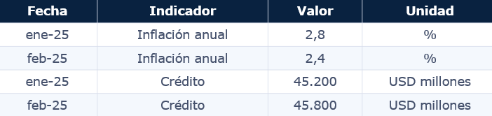

{width="272"}

{width="513"}

### ¿Qué es Business Intelligence?

"Es el conjunto de metodologías, tecnologías, procesos y herramientas
que permiten transformar datos en información útil para apoyar a la toma
de decisiones."

**¿Qué más puede sere Business Intelligence?**

"BI convierte datos en conocimiento y conocimiento en decisiones"

### ¿Por qué surge Business Intelligence?

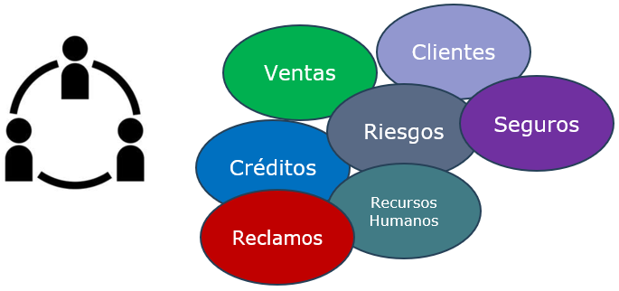{width="539"}

{width="737"}

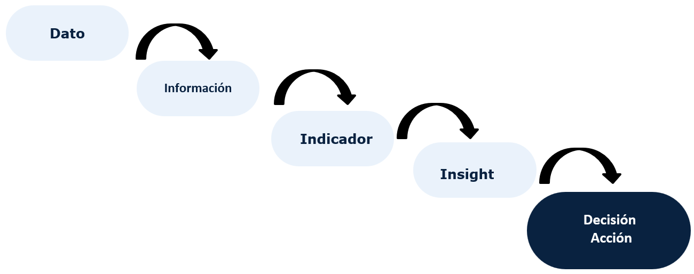{width="539"}

**Business Intelligence: Son procesos, prácticas y tecnologías que
transforman datos en información útil para decidir.**

### Evolución de Business Intelligence

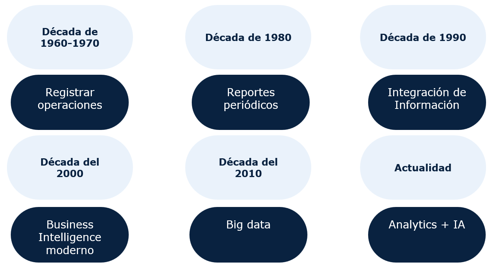{width="539"}

### Rol del dato en las organizaciones

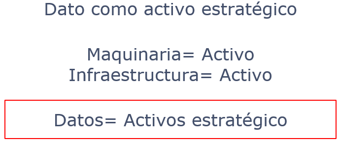{width="539"}

### Analogía

{width="539"}

{width="539"}

### Valor de los datos

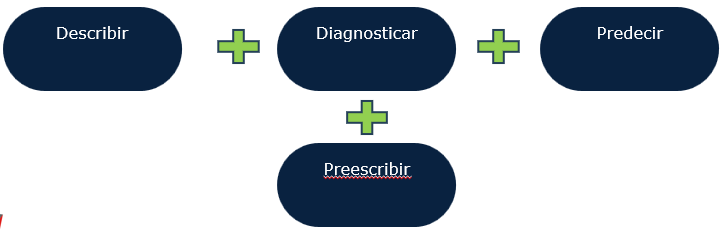{width="539"}

### Cultura Data Driven

Una organización data-driven toma decisiones fundamentadas en datos y
evidencia.

-   No en opiniones

-   No en intuición

-   No en supuestos

{width="539"}

### Características de una cultura data-driven

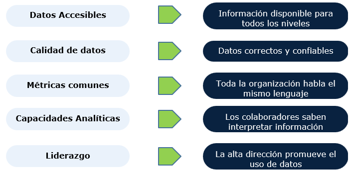{width="539"}

### Barreras comunes de una cultura data-driven

-   Datos dispersos

-   Mala calidad

-   Resistencia al cambio

-   Falta de capacitación

-   Exceso de excel

### Madurez analítica

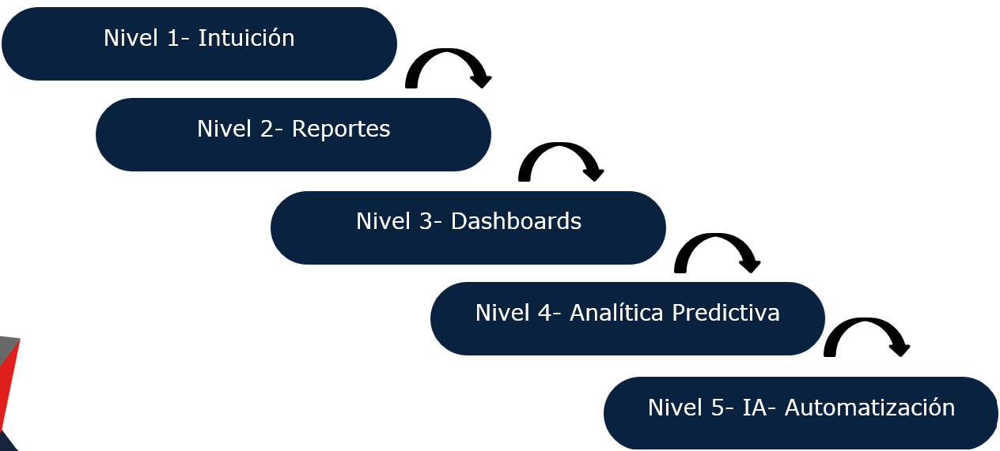{width="539"}

### Casos de uso

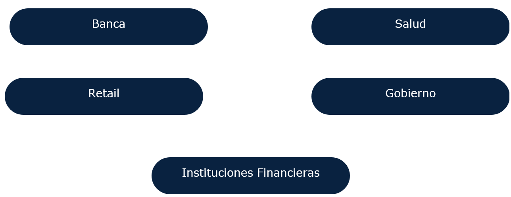{width="539"}

## 2. Unidad 2

### Analítica descriptiva

Proceso de usar datos históricos para responde una pregunta clave.

**¿Qué paso?...**

Funciona como el punto de partida en el análisis de datos. Reúne
información del pasado, la organiza y te muestra qué tendencias o
patrones existieron, sin buscar todavía las causas profundas o predecir
el futuro

### ¿Cómo funciona y que herramientas usa?

-   **Resumen de datos:** Toma montañas de datos sin procesar y los
    convierte en cifras comprensibles.

-   **Estadística básica:** Utiliza promedios, medianas, modas y
    desviaciones estándar.

-   **Visualización:** Emplea gráficos, tablas y tableros interactivos
    (*dashboards*) para ver la información de un vistazo

**Ejemplos:**

-   **Redes sociales:** Ver cuántos seguidores nuevos ganaste la semana
    pasada tras publicar un video específico.

-   **Ventas:** Calcular el promedio de compra por cliente durante el
    último trimestre.

-   **Salud:** Revisar cuántos ingresos hubo en urgencias en los últimos
    tres días

### Analítica diagnóstica

Es un tipo de análisis de datos que responde a una pregunta clave.

**¿Por qué pasó esto?...**

### ¿Cómo funciona y que herramientas usa?

-   **Enfoque retrospectivo:** Mira hacia el pasado para explicar un
    resultado actual o un problema ya detectado.

-   **Búsqueda de causas:** Utiliza técnicas como análisis de causa
    raíz, detección de anomalías y correlaciones estadísticas.

-   **Cruces de información:** Combina múltiples fuentes de datos
    (muchas veces internas) para ver cómo distintas variables se
    relacionan entre sí.

**Ejemplos:**

-   **En ventas:** Si la analítica descriptiva te muestra que las ventas
    bajaron un 15% este mes, la analítica diagnóstica investiga el
    porqué: descubre que coincidió con una falla temporal en la pasarela
    de pagos o con la subida de precios de la competencia.

-   **En medicina:** Si las pruebas de un paciente muestran niveles
    alterados, el diagnóstico médico (como análogo físico) busca la
    causa subyacente de esa anomalía en su historial o síntomas.

-   **En sistemas o tecnología:** Ayuda a entender por qué un servidor
    falló a una hora específica al correlacionar el pico de tráfico con
    la falta de memoria RAM.

### Analítica Predictiva

Rama del análisis de datos que utiliza información histórica,
estadística y técnicas de aprendizaje automático (machine learning) para
calcular la probabilidad de que ocurran eventos futuros.

Su meta principal es ir más allá de solo entender qué pasó o por qué
pasó, para anticiparse y saber qué es más probable que suceda.
(Proabilidades)(Esperanza matemática).

### ¿Cómo funciona y que herramientas usa?

-   **Datos históricos:** Se alimentan los sistemas con registros del
    pasado y del presente.

-   **Patrones:** Los algoritmos buscan conexiones ocultas o
    comportamientos repetitivos en esos datos.

-   **Predicción:** Se generan modelos matemáticos para estimar
    resultados futuros con un nivel alto de certeza

**Ejemplos:**

-   **Banca y fraudes:** Detectar si una transacción es sospechosa antes
    de que se apruebe.

-   **Comercio (Retail):** Predecir qué productos comprarán los clientes
    o qué tanta demanda habrá en una temporada.

-   **Salud:** Anticipar qué pacientes tienen riesgo de empeorar o
    desarrollar una enfermedad.

-   **Mantenimiento industrial:** Saber cuándo una máquina o pieza puede
    fallar para repararla antes de que se rompa.

### Analítica Prescriptiva

Fase más avanzada del análisis de datos. Responde a la pregunta:

**¿Qué deberíamos hacer?...**

Utiliza datos, modelos predictivos y algoritmos de optimización para
sugerir las acciones óptimas que permiten alcanzar un objetivo
específico.

Esto es ir más allá de anticipar el futuro, es recomendar de forma
activa el mejor camino a seguir. (Acción / Decisión).

**Ejemplos:**

-   **Logística y rutas:** Calcular en tiempo real la ruta de reparto
    más barata y rápida considerando el tráfico y el clima.

-   **Precios dinámicos:** Sugerir el precio exacto de un boleto de
    avión o producto según la demanda prevista para maximizar ganancias.

-   **Sector salud:** Recomendar el tratamiento más adecuado para un
    paciente combinando su historial médico con datos de miles de casos
    similares.

Si lo entendimos tenemos una caja de herramientas potente para analizar
datos, transformarlos en información, conocimiento y transformarlos en
una decisión y acción.

**¿Qué vamos hacer?**

Sobre **una misma base de datos** (`Balance_SB.xlsx`, balances mensuales
del sistema bancario privado ecuatoriano, enero 2017 – agosto 2026),
respondemos las cuatro preguntas de la analítica de datos:

| Etapa | Pregunta | Técnica en esta unidad |
|----|----|----|
| **Descriptiva** | ¿Qué pasó? | Tendencia, niveles, variaciones |
| **Diagnóstica** | ¿Por qué pasó y con qué se relaciona? | Correlación, segmentación, indicadores de riesgo |
| **Predictiva** | ¿Qué podría pasar? | Machine Learning (Python) / Series de tiempo (R) |
| **Prescriptiva** | ¿Qué deberíamos hacer? | Reglas de decisión, simulación de escenarios |

El documento tiene dos pistas completas y paralelas: 🐍 **Python** y 📊
**R**, cada una recorriendo las cuatro etapas sobre el mismo caso, para
que compares cómo se resuelve el mismo problema en ambos lenguajes.

### El caso: Cartera de créditos

La cuenta `14 - CARTERA DE CRÉDITOS` es una serie histórica que refleja
datos sobre el comportamiento de créditos en el Ecuador.

Adicional tenemos dos conceptos importantes.

-   **Ratio de morosidad (NPL ratio)** = cartera vencida / cartera bruta
-   **Ratio de cobertura** = provisiones / cartera vencida

::: callout-note
### Estructura del archivo

`Balance_SB.xlsx`, hoja `Hoja1`: encabezado en la fila 6 (`CODIGO`,
`CUENTA` y 116 columnas mensuales de fecha, de 2017-01-31 a 2026-08-31).
Los códigos de 2 dígitos son cuentas mayores (ej. `14`), de 4 dígitos
son subcuentas (ej. `1401`, `1499`), de 6 dígitos son el detalle más
fino.
:::

### 🐍 Pista Python {#sec-python-datos}

### Preparación de los datos

```{python}
#| label: py-setup

# Importamos las librerias respectivas
import pandas as pd                    
import numpy as np
import datetime
import matplotlib.pyplot as plt
import matplotlib.dates as mdates

plt.rcParams["figure.figsize"] = (9, 4.5)
plt.rcParams["axes.spines.top"] = False
plt.rcParams["axes.spines.right"] = False

AZUL = "#1f4e79"
NARANJA = "#F2B134"
ROJO = "#C0392B"
GRIS = "#7f8c8d"
```

-   **Pandas (`pd`)**: permite cargar, limpiar y analizar datos
    tabulares.

-   **NumPy (`np`)**: proporciona funciones matemáticas y manejo
    eficiente de datos numéricos.

-   **Datetime**: facilita el trabajo con fechas y períodos de tiempo.

-   **Matplotlib (`plt`)**: se utiliza para crear gráficos y
    visualizaciones.

-   **Matplotlib Dates (`mdates`)**: permite formatear fechas en los
    ejes de los gráficos.

-   **`plt.rcParams["figure.figsize"] = (9, 4.5)`**: define el tamaño
    predeterminado de las figuras. (Esta detallado en pulgadas)

-   **`axes.spines.top` y `axes.spines.right`**: eliminan los bordes
    superior y derecho para mejorar la presentación visual.

-   **Variables `AZUL`, `NARANJA`, `ROJO` y `GRIS`**: almacenan códigos
    de colores que se utilizarán de forma consistente en las
    visualizaciones del análisis.

```{python}
#| label: py-carga1
#| echo: true

# Carga del archivo Excel
raw = pd.read_excel(
    "C:/Users/wramos/OneDrive - SUPERINTENDENCIA DE BANCOS/Documentos/William Ramos personal/DIPLOMADO BI_CEC SEPTIEMBRE/BASE QMD/Balance_SB.xlsx",
    sheet_name="Hoja1",
    header=5
)

# ==========================================================
# EXPLORACIÓN INICIAL DE LA BASE DE DATOS
# ==========================================================

# Dimensiones
filas, columnas = raw.shape
print(f"Número de registros: {filas:,}")
print(f"Número de variables: {columnas}")

# Tipos de datos
print("\nTipos de variables:")
print(raw.dtypes.value_counts())

# Primeras observaciones
raw.head()

# Valores faltantes
na_resumen = (
    raw.isna()
       .sum()
       .reset_index()
)

na_resumen.columns = ["Variable", "Valores_faltantes"]

print("\nVariables con valores faltantes:")
na_resumen[na_resumen["Valores_faltantes"] > 0].head(20)

# Columnas identificadas como fechas
date_cols = [
    c for c in raw.columns
    if isinstance(c, (pd.Timestamp, datetime.datetime))
]

print(f"\nNúmero de períodos identificados: {len(date_cols)}")
print("Primera fecha:", min(date_cols))
print("Última fecha:", max(date_cols))
```

```{python}
#| label: py-carga

raw = pd.read_excel(
    "C:/Users/wramos/OneDrive - SUPERINTENDENCIA DE BANCOS/Documentos/William Ramos personal/DIPLOMADO BI_CEC SEPTIEMBRE/BASE QMD/Balance_SB.xlsx",
    sheet_name="Hoja1",
    header=5
)

# Columnas de fecha: pandas ya las reconoce como datetime porque el Excel
# tiene formato de fecha en esas celdas de encabezado.
date_cols = [c for c in raw.columns if isinstance(c, (pd.Timestamp, datetime.datetime))]

def serie(codigo: float) -> pd.Series:
    """Devuelve la serie mensual de una cuenta a partir de su código."""
    return raw.loc[raw["CODIGO"] == codigo, date_cols].iloc[0].astype(float)

cartera_bruta = serie(14)      # 14 - CARTERA DE CRÉDITOS
provisiones   = serie(1499)    # 1499 - (PROVISIONES), ya viene negativa
total_activos = serie(1)       # 1 - TOTAL ACTIVOS
fondos_disp   = serie(11)      # 11 - FONDOS DISPONIBLES (liquidez)

# Cartera vencida = suma de subcuentas 1400-1499 cuyo nombre contiene "VENCIDA"
es_cartera = raw["CODIGO"].apply(lambda x: pd.notna(x) and 1400 <= x < 1500)
es_vencida = raw["CUENTA"].astype(str).str.upper().str.contains("VENCIDA")
cartera_vencida = raw.loc[es_cartera & es_vencida, date_cols].sum()

df = pd.DataFrame({
    "fecha": date_cols,
    "cartera_bruta": cartera_bruta.values,
    "provisiones": provisiones.values,
    "cartera_vencida": cartera_vencida.values,
    "total_activos": total_activos.values,
    "fondos_disponibles": fondos_disp.values,
}).sort_values("fecha").reset_index(drop=True)

# --- el "truco contable": cartera neta = bruta + provisiones (negativas) ---
df["cartera_neta"] = df["cartera_bruta"] + df["provisiones"]
df["npl_ratio"] = df["cartera_vencida"] / df["cartera_bruta"]
df["cobertura"] = -df["provisiones"] / df["cartera_vencida"]
df["participacion_cartera"] = df["cartera_neta"] / df["total_activos"]
df["npl_chg_mom"] = df["npl_ratio"].pct_change() * 100

df.tail()
```

### Construcción de la base analítica

-   Se importa el archivo `Balance_SB.xlsx` desde la hoja `Hoja1` y se
    almacena en el DataFrame `raw`.

-   Se identifican automáticamente las columnas correspondientes a
    fechas, las cuales representan los períodos mensuales de análisis.

-   Se crea la función `serie(codigo)`, que permite extraer la serie
    histórica de cualquier cuenta contable utilizando su código.

-   Se obtienen las series de:

    -   Cartera bruta de créditos (código 14).

    -   Provisiones para créditos incobrables (código 1499).

    -   Total de activos (código 1).

    -   Fondos disponibles o liquidez (código 11).

### Cálculo de la cartera vencida

-   Se seleccionan las cuentas del grupo cartera de créditos (códigos
    entre 1400 y 1499).

-   Se identifican aquellas que contienen la palabra **"VENCIDA"** en el
    nombre de la cuenta.

-   Se suman sus valores para obtener la cartera vencida total de cada
    período.

### Creación de la base temporal

-   Se construye un DataFrame denominado `df`.

-   Cada fila representa un mes.

-   Se integran en una sola tabla las variables:

    -   Fecha.

    -   Cartera bruta.

    -   Provisiones.

    -   Cartera vencida.

    -   Total de activos.

    -   Fondos disponibles.

### Construcción de indicadores financieros

-   **Cartera neta** = Cartera bruta + Provisiones.

-   **Ratio de morosidad (NPL Ratio)** = Cartera vencida / Cartera
    bruta.

-   **Ratio de cobertura** = Provisiones / Cartera vencida.

-   **Participación de la cartera en activos** = Cartera neta / Total de
    activos.

-   **Variación mensual del NPL Ratio** = porcentaje de cambio mensual
    de la morosidad.

### Validación de resultados

-   Se utiliza `df.tail()` para visualizar las últimas observaciones de
    la base construida y verificar que los cálculos fueron realizados
    correctamente.

### 1. Analítica descriptiva — ¿Qué pasó? {#sec-python-descriptiva}

```{python}
#| label: py-descriptiva-stats

crecimiento_total = (df["cartera_neta"].iloc[-1] / df["cartera_neta"].iloc[0] - 1) * 100
n_meses = len(df) - 1
cagr_anual = ((df["cartera_neta"].iloc[-1] / df["cartera_neta"].iloc[0]) ** (12 / n_meses) - 1) * 100

resumen = pd.DataFrame({
    "métrica": ["Media (MM USD)", "Mediana (MM USD)", "Desv. estándar (MM USD)",
                "Mínimo (MM USD)", "Máximo (MM USD)",
                "Crecimiento total del período (%)", "CAGR anualizado (%)"],
    "valor": [df["cartera_neta"].mean() / 1e6, df["cartera_neta"].median() / 1e6,
              df["cartera_neta"].std() / 1e6, df["cartera_neta"].min() / 1e6,
              df["cartera_neta"].max() / 1e6, crecimiento_total, cagr_anual],
})
resumen.round(2)
```

### Estadísticas descriptivas de la cartera neta

-   Se calcula el crecimiento total del período, comparando el valor
    final y el valor inicial de la cartera neta.

-   Se determina el número de meses disponibles en la serie histórica.

-   Se calcula la tasa de crecimiento anual compuesta (CAGR), que
    refleja el crecimiento promedio anual de la cartera durante todo el
    período analizado.

### Construcción del resumen estadístico

-   Se crea una tabla denominada `resumen` que consolida los principales
    indicadores descriptivos de la cartera neta.

-   Se calculan las siguientes medidas:

    -   **Media:** valor promedio de la cartera neta.

    -   **Mediana:** valor central de la serie.

    -   **Desviación estándar:** medida de dispersión de los datos.

    -   **Mínimo:** valor más bajo observado.

    -   **Máximo:** valor más alto observado.

    -   **Crecimiento total:** variación porcentual entre el primer y
        último período.

    -   **CAGR anualizado:** ritmo promedio de crecimiento anual de la
        cartera neta.

### Presentación de resultados

-   Los valores monetarios se expresan en millones de dólares (MM USD)
    mediante la división entre 1.000.000.

-   La instrucción `resumen.round(2)` redondea todos los resultados a
    dos decimales para facilitar su lectura e interpretación.

```{python}
#| label: fig-py-tendencia
#| fig-cap: "Cartera de créditos neta, 2017–2026"

fig, ax = plt.subplots()
ax.plot(df["fecha"], df["cartera_neta"] / 1e6, color=AZUL, linewidth=1.8, label="Cartera neta")
ax.plot(df["fecha"], df["cartera_bruta"] / 1e6, color=GRIS, linewidth=1, linestyle="--", label="Cartera bruta")
ax.set_ylabel("Millones USD")
ax.set_title("Cartera de créditos: bruta vs. neta (bruta − |provisiones|)")
ax.legend()
ax.xaxis.set_major_locator(mdates.YearLocator())
ax.xaxis.set_major_formatter(mdates.DateFormatter("%Y"))
fig.tight_layout()
plt.show()
```

### Visualización de la cartera de créditos

-   Se crea una figura y un área de gráfico mediante `plt.subplots()`.

-   Se grafica la evolución de la cartera neta utilizando una línea
    azul.

-   Se grafica la evolución de la cartera bruta utilizando una línea
    gris discontinua.

-   Los valores se dividen para expresarlos en millones de dólares (MM
    USD).

-   Se agrega la etiqueta del eje vertical: Millones USD.

-   Se incorpora un título descriptivo al gráfico.

-   Se añade una leyenda para diferenciar la cartera bruta y la cartera
    neta.

-   Se configura el eje horizontal para mostrar únicamente los años.

-   Se ajusta automáticamente el diseño del gráfico para mejorar la
    presentación.

-   Finalmente, `plt.show()` muestra la visualización.

La cartera neta creció de forma prácticamente monótona en el período:
parte de cerca de USD 17.6 mil millones en enero de 2017 y cierra en
aproximadamente USD 48.2 mil millones en agosto de 2026, con una tasa de
crecimiento anual compuesta cercana al valor calculado arriba. La
distancia entre la línea bruta y la neta (las provisiones) también crece
en términos absolutos, lo cual conviene revisar en la etapa diagnóstica.

### 2. Analítica diagnóstica — ¿Con qué se relaciona? {#sec-python-diagnostica}

```{python}
#| label: fig-py-npl
#| fig-cap: "Ratio de morosidad (NPL) mensual, con el inicio de la pandemia señalado"

fig, ax = plt.subplots()
ax.plot(df["fecha"], df["npl_ratio"] * 100, color=ROJO, linewidth=1.6)
ax.axvline(pd.Timestamp("2020-03-01"), color=GRIS, linestyle=":", linewidth=1)
ax.text(pd.Timestamp("2020-04-01"), df["npl_ratio"].max() * 100 * 0.95, "COVID-19",
        rotation=90, va="top", color=GRIS, fontsize=9)
ax.set_ylabel("% cartera vencida / cartera bruta")
ax.set_title("Ratio de morosidad (NPL ratio)")
fig.tight_layout()
plt.show()
```

-   Se crea una figura para representar la evolución temporal del ratio
    de morosidad.

-   Se grafica el indicador NPL Ratio (cartera vencida / cartera bruta)
    expresado en porcentaje.

-   Se incorpora una línea vertical en marzo de 2020 para señalar el
    inicio de la pandemia de COVID-19.

-   Se añade una etiqueta de texto para identificar visualmente dicho
    evento.

-   Se configura el eje vertical para mostrar el porcentaje de cartera
    vencida respecto a la cartera bruta.

-   Se agrega un título descriptivo al gráfico.

-   Se ajusta automáticamente el diseño de la figura para mejorar su
    presentación.

-   Finalmente, `plt.show()` genera la visualización.

```{python}
#| label: fig-py-correlacion
#| fig-cap: "Correlación entre variaciones mensuales de cartera, activos y liquidez"

variaciones = pd.DataFrame({
    "Δ cartera neta": df["cartera_neta"].pct_change(),
    "NPL ratio (nivel)": df["npl_ratio"],
    "Δ total activos": df["total_activos"].pct_change(),
    "Δ fondos disponibles": df["fondos_disponibles"].pct_change(),
}).dropna()

corr = variaciones.corr()

fig, ax = plt.subplots(figsize=(5.5, 4.5))
im = ax.imshow(corr, cmap="RdBu_r", vmin=-1, vmax=1)
ax.set_xticks(range(len(corr.columns)), corr.columns, rotation=40, ha="right")
ax.set_yticks(range(len(corr.columns)), corr.columns)
for i in range(len(corr.columns)):
    for j in range(len(corr.columns)):
        ax.text(j, i, f"{corr.iloc[i, j]:.2f}", ha="center", va="center", fontsize=9)
fig.colorbar(im, shrink=0.8, label="correlación")
ax.set_title("Matriz de correlación")
fig.tight_layout()
plt.show()
```

-   Se crea una nueva base llamada `variaciones`.

<!-- -->

-   `pct_change()` calcula la variación porcentual mensual de cada
    variable.

<!-- -->

-   Se incorporan cuatro indicadores:

    -   Variación de la cartera neta.

    -   Nivel de morosidad (NPL ratio).

    -   Variación del total de activos.

    -   Variación de los fondos disponibles (liquidez).

<!-- -->

-   `dropna()` elimina los registros vacíos generados por el cálculo de
    variaciones.

```{python}
#| label: py-diagnostico-tabla

diagnostico = df[["fecha", "npl_ratio", "cobertura", "participacion_cartera"]].describe().T
diagnostico.round(4)
```

-   Se calcula la **matriz de correlación de Pearson**.

-   La correlación mide el grado de asociación lineal entre dos
    variables.

-   Sus valores pueden variar entre:

    -   **+1:** relación positiva perfecta.

    -   **0:** sin relación lineal.

    -   **−1:** relación negativa perfecta.

-   Por ejemplo:

-   Si la correlación entre cartera y activos es **0.90**, ambas
    variables tienden a crecer juntas.

-   Si la correlación entre cartera y morosidad es **−0.40**, cuando una
    aumenta la otra suele disminuir.

**Lectura diagnóstica:** la variación de la cartera neta se relaciona
más con la variación del total de activos que con la de los fondos
disponibles (liquidez), y se relaciona negativamente con el nivel del
NPL ratio: en los meses en que la cartera crece más rápido, la morosidad
relativa tiende a ser menor. El quiebre de marzo–mayo de 2020 (COVID-19)
es visible como un salto puntual del NPL ratio, no como un cambio de
tendencia permanente.

### 3. Analítica predictiva — Machine Learning {#sec-python-predictiva}

Construimos variables de rezago (*lags*) de la cartera neta y comparamos
dos modelos sobre los últimos 12 meses como conjunto de prueba: una
regresión lineal y un Random Forest.

```{python}
#| label: py-predictiva-features

from sklearn.linear_model import LinearRegression
from sklearn.ensemble import RandomForestRegressor
from sklearn.metrics import mean_absolute_error, mean_squared_error

modelo_df = df.copy()
for lag in [1, 2, 3, 6, 12]:
    modelo_df[f"lag_{lag}"] = modelo_df["cartera_neta"].shift(lag)
modelo_df["mes"] = modelo_df["fecha"].dt.month
modelo_df["npl_lag1"] = modelo_df["npl_ratio"].shift(1)
modelo_df = modelo_df.dropna().reset_index(drop=True)

cols_feat = ["lag_1", "lag_2", "lag_3", "lag_6", "lag_12", "mes", "npl_lag1"]
X, y = modelo_df[cols_feat], modelo_df["cartera_neta"]

n_test = 12
X_train, X_test = X.iloc[:-n_test], X.iloc[-n_test:]
y_train, y_test = y.iloc[:-n_test], y.iloc[-n_test:]
fechas_test = modelo_df["fecha"].iloc[-n_test:]

reg_lineal = LinearRegression().fit(X_train, y_train)
bosque = RandomForestRegressor(n_estimators=300, max_depth=6, random_state=42).fit(X_train, y_train)

pred_lineal = reg_lineal.predict(X_test)
pred_bosque = bosque.predict(X_test)

def metricas(y_true, y_pred, nombre):
    return {
        "modelo": nombre,
        "MAE (MM USD)": mean_absolute_error(y_true, y_pred) / 1e6,
        "RMSE (MM USD)": mean_squared_error(y_true, y_pred) ** 0.5 / 1e6,
        "MAPE (%)": (np.abs((y_true - y_pred) / y_true)).mean() * 100,
    }

pd.DataFrame([metricas(y_test, pred_lineal, "Regresión lineal"),
              metricas(y_test, pred_bosque, "Random Forest")]).round(3)
```

### Construcción de variables predictoras

-   Se importan los algoritmos de Regresión Lineal y Random Forest de la
    librería Scikit-Learn.

-   Se crea una copia de la base de datos original para construir el
    conjunto de modelamiento.

-   Se generan variables de rezago (lags) de la cartera neta:

    -   Lag 1: valor de la cartera un mes atrás.

    -   Lag 2: valor de la cartera dos meses atrás.

    -   Lag 3: valor de la cartera tres meses atrás.

    -   Lag 6: valor de la cartera seis meses atrás.

    -   Lag 12: valor de la cartera doce meses atrás.

-   Se incorpora el número de mes para capturar posibles patrones
    estacionales.

-   Se añade el NPL Ratio rezagado un período como indicador de riesgo
    de crédito.

-   Se eliminan las observaciones con valores faltantes generados por
    los rezagos.

-   Las variables explicativas (X) corresponden a los rezagos de la
    cartera, el mes y el NPL Ratio.

-   La variable objetivo (y) es la cartera neta.

-   El modelo intentará aprender la relación entre estas variables para
    estimar el valor futuro de la cartera.

    **Separación de datos**

-   Se reservan los últimos 12 meses como conjunto de prueba.

-   Los datos anteriores se utilizan para entrenar los modelos.

-   Esta estrategia permite evaluar la capacidad predictiva utilizando
    información que el modelo no observó durante el entrenamiento.

    **Entrenamiento de modelos**

-   Se ajusta un modelo de Regresión Lineal.

-   Asume una relación lineal entre las variables explicativas y la
    cartera neta.

<!-- -->

-   Se ajusta un modelo Random Forest.

-   Este algoritmo combina múltiples árboles de decisión para realizar
    predicciones más flexibles y capturar relaciones no lineales.

    **Generación de pronósticos**

-   Ambos modelos generan predicciones para los últimos 12 meses de la
    serie.

-   Estas predicciones serán comparadas con los valores reales
    observados.

    **Métricas de evaluación**

    -   MAE (Mean Absolute Error): error promedio absoluto entre valores
        reales y predichos.

    -   RMSE (Root Mean Squared Error): penaliza más los errores de gran
        magnitud.

    -   MAPE (Mean Absolute Percentage Error): expresa el error promedio
        como porcentaje.

    **Comparación entre modelos**

    -   Se construye una tabla comparativa con las métricas de error.

    -   El modelo que presente menores valores de MAE, RMSE y MAPE
        tendrá un mejor desempeño predictivo.

    -   Los resultados permiten determinar cuál algoritmo es más
        adecuado para proyectar la evolución de la cartera neta.

```{python}
#| label: fig-py-prediccion
#| fig-cap: "Cartera neta observada vs. predicha (últimos 12 meses)"

fig, ax = plt.subplots()
ax.plot(df["fecha"], df["cartera_neta"] / 1e6, color=GRIS, linewidth=1, label="Histórico completo")
ax.plot(fechas_test, y_test / 1e6, color=AZUL, marker="o", markersize=3, label="Real (prueba)")
ax.plot(fechas_test, pred_lineal / 1e6, color=NARANJA, linestyle="--", label="Predicho — Reg. lineal")
ax.plot(fechas_test, pred_bosque / 1e6, color=ROJO, linestyle=":", label="Predicho — Random Forest")
ax.set_ylabel("Millones USD")
ax.set_title("Comparación de modelos en el conjunto de prueba")
ax.legend(fontsize=8)
fig.tight_layout()
plt.show()
```

-   Se crea una figura para representar el comportamiento histórico y
    las predicciones de la cartera neta.

-   Se grafica la serie histórica completa de la cartera neta como
    referencia.

-   Se destacan los valores reales correspondientes al conjunto de
    prueba (últimos 12 meses).

-   Se incorporan las predicciones generadas por el modelo de Regresión
    Lineal.

-   Se incorporan las predicciones generadas por el modelo Random
    Forest.

-   Se expresan los valores en millones de dólares (MM USD).

-   Se agrega una leyenda para identificar cada serie.

-   Finalmente, se muestra la comparación gráfica entre los valores
    observados y los estimados por cada modelo.

::: callout-important
#### Lección del modelo

En una serie con tendencia creciente sostenida, la **regresión lineal
supera claramente al Random Forest** en este caso. Los árboles de
decisión (y el Random Forest, que promedia árboles) no pueden predecir
valores fuera del rango de la variable objetivo que vieron en
entrenamiento: si la cartera sigue creciendo, el bosque "se queda corto"
de forma sistemática. Esto no es un error de código: es una limitación
estructural de los modelos basados en árboles frente a series con
tendencia — una idea clave para decidir qué modelo usar en un caso real.
:::

### 4. Analítica prescriptiva — ¿Qué deberíamos hacer? {#sec-python-prescriptiva}

Definimos una regla de negocio simple sobre la variación mensual del NPL
ratio, y una simulación de escenarios de estrés sobre la cartera vencida
más reciente.

```{python}
#| label: py-regla-alerta

umbral_alerta = 8.0  # % de variación mensual del NPL ratio

df["accion"] = np.select(
    [df["npl_chg_mom"] > umbral_alerta, df["npl_chg_mom"] > 3],
    ["🔴 Alerta: deterioro acelerado, revisar política de originación",
     "🟡 Vigilancia: monitorear próximos meses"],
    default="🟢 Normal",
)

df.loc[df["accion"].str.contains("Alerta"), ["fecha", "npl_ratio", "npl_chg_mom", "accion"]]
```

### Construcción de una regla prescriptiva

-   Se implementa una regla automática de monitoreo basada en la
    variación mensual del ratio de morosidad (NPL Ratio).

-   Se establece un umbral de alerta del 8%, a partir del cual se
    considera que existe un deterioro acelerado en la calidad de la
    cartera.

-   Incrementos superiores al 3% generan una señal de vigilancia
    preventiva.

-   Cuando no se observan aumentos relevantes en la morosidad, la
    situación se clasifica como normal.

-   Finalmente, se identifican los períodos que activan alertas para
    facilitar el seguimiento y la toma de decisiones por parte de la
    institución.

La regla identifica automáticamente los meses de mayor aceleración de la
morosidad — incluyendo abril, mayo y septiembre de 2020 (efecto
COVID-19) y enero de 2023 — sin que nadie los haya señalado manualmente:
esto es exactamente lo que hace útil una regla prescriptiva sobre datos
reales.

```{python}
#| label: py-escenarios

ultimo = df.iloc[-1]
provision_actual = -ultimo["provisiones"]

escenarios = pd.DataFrame({"shock_morosidad_%": [0, 10, 25, 50, 100]})
escenarios["cartera_vencida_proyectada"] = ultimo["cartera_vencida"] * (1 + escenarios["shock_morosidad_%"] / 100)
escenarios["cobertura_resultante"] = provision_actual / escenarios["cartera_vencida_proyectada"]
escenarios["accion"] = np.where(escenarios["cobertura_resultante"] < 1,
                                 "🔴 Reforzar provisiones", "🟢 Capacidad suficiente")
escenarios.round(3)
```

### Construcción de una regla prescriptiva

-   Se implementa una regla automática de monitoreo basada en la
    variación mensual del ratio de morosidad (NPL Ratio).

-   Se establece un umbral de alerta del 8%, a partir del cual se
    considera que existe un deterioro acelerado en la calidad de la
    cartera.

-   Incrementos superiores al 3% generan una señal de vigilancia
    preventiva.

-   Cuando no se observan aumentos relevantes en la morosidad, la
    situación se clasifica como normal.

-   Finalmente, se identifican los períodos que activan alertas para
    facilitar el seguimiento y la toma de decisiones por parte de la
    institución.

```{python}
#| label: py-cobertura-actual
print(f"Cobertura actual: {ultimo['cobertura']:.1f}x la cartera vencida")
```

-   Toma el valor de la variable `cobertura` del último período
    disponible.

<!-- -->

-   Lo formatea con un decimal (`:.1f`).

<!-- -->

-   Imprime un mensaje fácil de interpretar.

Con la cobertura mostrada arriba, el sistema podría absorber un choque
de morosidad considerable antes de quedar sub-provisionado bajo el
estándar de cobertura 100%: una conclusión accionable, no solo
descriptiva.

# 📊 Pista R

## Preparación de los datos {#sec-r-datos}

```{r}
#| label: r-setup

# Puente Python <-> R dentro del mismo documento (requiere el paquete reticulate)
library(reticulate)

use_python(
  "C:/Users/wramos/AppData/Local/Programs/Python/Python314/python.exe",
  required = TRUE
)
library(tidyverse)
library(readxl)
library(lubridate)
library(scales)
library(forecast)

AZUL   <- "#1f4e79"
NARANJA <- "#F2B134"
ROJO   <- "#C0392B"
GRIS   <- "#7f8c8d"

theme_set(theme_minimal(base_size = 12))
```

```{r}
#| label: r-carga

raw <- read_excel(
  "C:/Users/wramos/OneDrive - SUPERINTENDENCIA DE BANCOS/Documentos/William Ramos personal/DIPLOMADO BI_CEC SEPTIEMBRE/BASE QMD/Balance_SB.xlsx",
  sheet = "Hoja1",
  skip = 5
)

# Las columnas de fecha son la 3 a la 118 (verificado contra la estructura
# del archivo). Se seleccionan por POSICIÓN y no por nombre porque readxl
# coacciona los encabezados de fecha a texto al leerlos como nombres de
# columna, lo cual no es confiable para volver a parsearlos como fecha.
idx_fecha <- 3:118
fechas <- seq(ymd("2017-01-01"), ymd("2026-08-01"), by = "month") |>
  ceiling_date(unit = "month") - days(1)
stopifnot(length(fechas) == length(idx_fecha))

obtener_serie <- function(codigo) {
  fila <- raw |> filter(CODIGO == codigo)
  fila[1, idx_fecha] |> unlist(use.names = FALSE) |> as.numeric()
}

cartera_bruta <- obtener_serie(14)     # 14 - CARTERA DE CRÉDITOS
provisiones   <- obtener_serie(1499)   # 1499 - (PROVISIONES), ya negativa
total_activos <- obtener_serie(1)      # 1 - TOTAL ACTIVOS
fondos_disp   <- obtener_serie(11)     # 11 - FONDOS DISPONIBLES

vencida_df <- raw |>
  filter(CODIGO >= 1400, CODIGO < 1500, str_detect(toupper(CUENTA), "VENCIDA"))
cartera_vencida <- colSums(vencida_df[, idx_fecha], na.rm = TRUE) |> as.numeric()

cartera <- tibble(
  fecha = fechas,
  cartera_bruta = cartera_bruta,
  provisiones = provisiones,
  cartera_vencida = cartera_vencida,
  total_activos = total_activos,
  fondos_disponibles = fondos_disp
) |>
  mutate(
    # --- el "truco contable": cartera neta = bruta + provisiones (negativas) ---
    cartera_neta = cartera_bruta + provisiones,
    npl_ratio = cartera_vencida / cartera_bruta,
    cobertura = -provisiones / cartera_vencida,
    participacion_cartera = cartera_neta / total_activos,
    npl_chg_mom = (npl_ratio / lag(npl_ratio) - 1) * 100
  )

tail(cartera)
```

## 1. Analítica descriptiva — ¿Qué pasó? {#sec-r-descriptiva}

```{r}
#| label: r-descriptiva-stats

resumen <- cartera |>
  summarise(
    media_MM = mean(cartera_neta) / 1e6,
    mediana_MM = median(cartera_neta) / 1e6,
    desv_MM = sd(cartera_neta) / 1e6,
    minimo_MM = min(cartera_neta) / 1e6,
    maximo_MM = max(cartera_neta) / 1e6,
    crecimiento_total_pct = (last(cartera_neta) / first(cartera_neta) - 1) * 100,
    cagr_pct = ((last(cartera_neta) / first(cartera_neta))^(12 / (n() - 1)) - 1) * 100
  )
knitr::kable(resumen, digits = 2)
```

```{r}
#| label: fig-r-tendencia
#| fig-cap: "Cartera de créditos neta, 2017–2026"

ggplot(cartera, aes(x = fecha)) +
  geom_line(aes(y = cartera_bruta / 1e6), color = GRIS, linewidth = 0.6, linetype = "dashed") +
  geom_line(aes(y = cartera_neta / 1e6), color = AZUL, linewidth = 1) +
  scale_y_continuous(labels = label_comma()) +
  labs(title = "Cartera de créditos: bruta (gris) vs. neta (azul)",
       subtitle = "bruta − |provisiones|", x = NULL, y = "Millones USD")
```

## 2. Analítica diagnóstica — ¿Con qué se relaciona? {#sec-r-diagnostica}

```{r}
#| label: fig-r-npl
#| fig-cap: "Ratio de morosidad (NPL) mensual"

ggplot(cartera, aes(fecha, npl_ratio * 100)) +
  geom_line(color = ROJO, linewidth = 0.9) +
  geom_vline(xintercept = as.Date("2020-03-01"), linetype = "dotted", color = GRIS) +
  annotate("text", x = as.Date("2020-04-15"), y = max(cartera$npl_ratio) * 100 * 0.95,
           label = "COVID-19", angle = 90, color = GRIS, size = 3) +
  labs(title = "Ratio de morosidad (NPL ratio)", x = NULL, y = "% cartera vencida / bruta")
```

```{r}
#| label: fig-r-correlacion
#| fig-cap: "Correlación entre variaciones mensuales"

variaciones <- cartera |>
  mutate(
    var_cartera = cartera_neta / lag(cartera_neta) - 1,
    var_activos = total_activos / lag(total_activos) - 1,
    var_liquidez = fondos_disponibles / lag(fondos_disponibles) - 1
  ) |>
  select(var_cartera, npl_ratio, var_activos, var_liquidez) |>
  drop_na()

mat_cor <- cor(variaciones)
colnames(mat_cor) <- rownames(mat_cor) <- c("Δ cartera neta", "NPL ratio", "Δ activos", "Δ liquidez")
paleta <- colorRampPalette(c(ROJO, "white", AZUL))(200)
corrplot::corrplot(mat_cor, method = "color", addCoef.col = "black",
                    tl.col = "black", tl.srt = 40, col = paleta)
```

**Lectura diagnóstica:** al igual que en la pista Python, la variación
de la cartera neta se explica más por la variación del total de activos
que por la liquidez, y se relaciona negativamente con el nivel del NPL
ratio.

## 3. Analítica predictiva — series de tiempo {#sec-r-predictiva}

A diferencia de la pista Python (Machine Learning), aquí usamos un
modelo clásico de **series de tiempo**: `auto.arima()` del paquete
`forecast`, seleccionando automáticamente el mejor modelo ARIMA por
criterio AIC.

```{r}
#| label: r-predictiva-ajuste

serie_ts <- ts(cartera$cartera_neta, start = c(2017, 1), frequency = 12)

# Separamos los últimos 12 meses para validar, igual que en Python
n_test <- 12
train_ts <- window(serie_ts, end = c(2025, 8))
test_ts  <- window(serie_ts, start = c(2025, 9))

modelo_arima <- auto.arima(train_ts)
pron_valid <- forecast(modelo_arima, h = length(test_ts))

knitr::kable(round(as.data.frame(accuracy(pron_valid, test_ts)), 3))
```

```{r}
#| label: fig-r-forecast
#| fig-cap: "Pronóstico ARIMA — próximos 6 meses (con toda la historia)"

modelo_final <- auto.arima(serie_ts)
pronostico_final <- forecast(modelo_final, h = 6)

autoplot(pronostico_final) +
  labs(title = paste0("Pronóstico ", pronostico_final$method, " — Cartera neta"),
       x = "Año", y = "USD")
```

El modelo `auto.arima` captura bien la tendencia sostenida de la serie
(a diferencia del Random Forest en Python) porque un ARIMA con
componente de tendencia sí puede **extrapolar** más allá del rango
histórico, mientras que un modelo de árboles no.

## 4. Analítica prescriptiva — ¿Qué deberíamos hacer? {#sec-r-prescriptiva}

```{r}
#| label: r-regla-alerta

umbral_alerta <- 8

alertas <- cartera |>
  mutate(
    accion = case_when(
      is.na(npl_chg_mom) ~ "Sin dato previo",
      npl_chg_mom > umbral_alerta ~ "🔴 Alerta: deterioro acelerado, revisar política de originación",
      npl_chg_mom > 3 ~ "🟡 Vigilancia: monitorear próximos meses",
      TRUE ~ "🟢 Normal"
    )
  )

alertas |>
  filter(str_detect(accion, "Alerta")) |>
  select(fecha, npl_ratio, npl_chg_mom, accion) |>
  knitr::kable(digits = 4)
```

```{r}
#| label: r-escenarios

ultimo <- cartera |> filter(fecha == max(fecha))
provision_actual <- -ultimo$provisiones

escenarios <- tibble(shock_morosidad_pct = c(0, 10, 25, 50, 100)) |>
  mutate(
    cartera_vencida_proyectada = ultimo$cartera_vencida * (1 + shock_morosidad_pct / 100),
    cobertura_resultante = provision_actual / cartera_vencida_proyectada,
    accion = if_else(cobertura_resultante < 1, "🔴 Reforzar provisiones", "🟢 Capacidad suficiente")
  )

knitr::kable(escenarios, digits = 2)
```

### Comparación de las dos pistas

| Etapa | Python | R |
|----|----|----|
| Descriptiva | `pandas` + `matplotlib` | `dplyr` + `ggplot2` |
| Diagnóstica | correlación con `numpy`/`pandas`, heatmap manual | `cor()`, `corrplot` |
| Predictiva | Machine Learning: regresión lineal vs. Random Forest (`scikit-learn`) | Serie de tiempo: `auto.arima` (`forecast`) |
| Prescriptiva | reglas con `numpy.select`, escenarios con `pandas` | reglas con `case_when`, escenarios con `dplyr` |

La conclusión técnica más importante de la unidad: **el mismo caso, la
misma pregunta, se puede resolver con dos enfoques predictivos
distintos** (ML vs. series de tiempo) y el resultado *no* es indiferente
— aquí la serie de tiempo captura mejor la tendencia que el modelo de
árboles, lo cual es una decisión de modelamiento, no una preferencia de
lenguaje.

**Pista final**

La cuenta `14 - CARTERA DE CRÉDITOS` en el balance es la cartera
**bruta**. Para obtener la cartera **neta** (lo que realmente espera
recuperar el banco) se aplica el ajuste contable estándar: restar la
cuenta `1499 - (PROVISIONES PARA CRÉDITOS INCOBRABLES)`.

$$ \text{Cartera neta} = \text{Cuenta 14 (bruta)} - |\text{Cuenta 1499 (provisiones)}| $$

En el archivo, la cuenta `1499` ya viene almacenada en negativo, así que
en código el ajuste es una simple **suma**:
`cartera_neta = cartera_bruta + provisiones`.

Adicionalmente usamos el detalle de **cartera vencida** (23 subcuentas
de 4 dígitos dentro del rango `1400–1499` cuyo nombre contiene
"VENCIDA") para construir dos indicadores clásicos de riesgo de crédito
que usaremos en las cuatro etapas:

-   **Ratio de morosidad (NPL ratio)** = cartera vencida / cartera bruta
-   **Ratio de cobertura** = provisiones / cartera vencida

## Actividad autónoma

1.  Cambia el umbral de la regla de alerta (`umbral_alerta`) a 5% y a
    12% en ambas pistas. ¿Cuántos meses de alerta se detectan en cada
    caso?
2.  Repite el diagnóstico segmentando por tipo de cartera (productivo,
    consumo, vivienda, microcrédito) usando los códigos `1401`–`1404` en
    vez del total.
3.  En la etapa predictiva, prueba `ets()` en R y compáralo contra
    `auto.arima` con `accuracy()`. ¿Cuál generaliza mejor en los últimos
    12 meses?

## 3. Unidad 3-Arquitectura de Datos

### Data Warehouse

Un Data Warehouse (DW) es un repositorio central diseñado para integrar,
organizar y conservar datos históricos de distintas fuentes con fines de
análisis y toma de decisiones.

-   Una base de datos operacional sirve principalmente para registrar
    operaciones del día a día.

-   Un Data Warehouse sirve principalmente para analizar lo que ha
    ocurrido en toda la organización.

**Características**

-   Datos estructurados.

<!-- -->

-   Orientado al análisis.

<!-- -->

-   Información histórica.

<!-- -->

-   Consultas SQL.

<!-- -->

-   Integración de múltiples fuentes.

### Arquitectura de tradicional

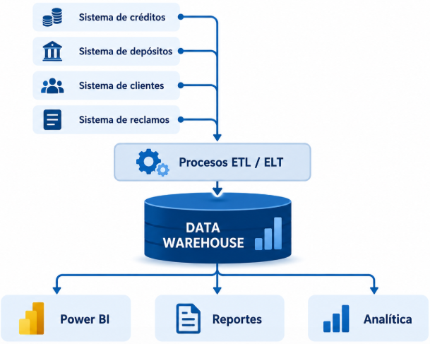

Supongamos que tienes cuatro sistemas separados:

-   Créditos: saldo, tasa, fecha, cliente.

-   Depósitos: cuenta, saldo, tipo de depósito.

-   Clientes: identificación, edad, ubicación.

-   Reclamos: tipo, fecha, institución.

Cada sistema puede funcionar perfectamente de manera independiente. El
problema aparece cuando la gerencia pregunta:

**“¿Cómo evolucionaron los depósitos y créditos durante los últimos
cinco años, por provincia, institución y tipo de cliente?”**

Consultar directamente todos los sistemas operacionales sería complejo y
potencialmente lento. Por eso se construye un Data Warehouse, donde los
datos se limpian, homologan e integran.

### ¿Qué tiene adentro?

Ó como se organizan las tablas dentro del Data Warehouse para facilitar
el análisis.

Un Data Warehouse no solo es una tabla gigante de datos. Generalmente
contiene varias tablas relacionadas.

Una forma muy común de organizar los datos es el modelo Estrella (Star
Schema), " Debido a su sencillez y velocidad".

### Modelo Estrella

**Una arquitectura típica puede usar un modelo estrella:**

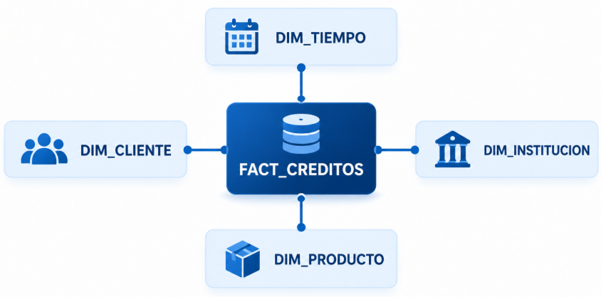

La tabla del centro, **FACT_VENTAS**, contiene las medidas numéricas del
negocio, por ejemplo:

| fecha_id | cliente_id | producto_id | sucursal_id | cantidad | total_venta |
|----------|------------|-------------|-------------|----------|-------------|
| 20260918 | 101        | 25          | 3           | 2        | 120.00      |
| 20260918 | 102        | 8           | 1           | 1        | 45.00       |

Es decir, ahí están los hechos que queremos analizar: cuánto se vendió,
cuántas unidades, qué saldo hubo, cuántas operaciones, etc.

Las tablas de alrededor son las dimensiones. Sirven para responder
preguntas como “¿por quién?”, “¿cuándo?”, “¿dónde?” y “¿qué?”.

Entonces, si en Power BI quieres responder:

> ¿Cuánto vendimos en 2026 por provincia y categoría de producto?

el sistema usa:

-   `FACT_VENTAS[total_venta]`

-   `DIM_FECHA[año]`

-   `DIM_CLIENTE[provincia]`

-   `DIM_PRODUCTO[categoria]`

Eso es lo que significa que **el Data Warehouse puede estar organizado
como un modelo estrella**.

La palabra “estrella” viene de su forma visual: una tabla de hechos en
el centro y varias dimensiones alrededor, como los brazos de una
estrella.

***"El Data Warehouse almacena información ya organizada para análisis.
Una estructura común es el modelo estrella, donde una tabla central
contiene los valores que queremos medir y las tablas de alrededor
describen esos valores".***

Pero el modelo estrella no es el único modelo, exitem varios modelos.
que conviven dentro de la misma estructura....

### Modelo copo de nieve

Es una variación directa del modelo estrella, pero con una diferencia
clave: las tablas de dimensiones están normalizadas (divididas en
subtablas) para eliminar la redundancia de datos.

-   **Estructura:** La tabla de hechos está en el centro, conectada a
    dimensiones que, a su vez, se conectan a otras dimensiones
    secundarias (lo que le da forma de copo de nieve).

-   **Ventaja:** Ahorra espacio de almacenamiento y mantiene la
    integridad de los datos.

-   **Desventaja:** Requiere más uniones (*joins*) en las consultas, lo
    que reduce el rendimiento en comparación con la estrella.

### Data Vault

Es un modelo moderno diseñado específicamente para Data Warehouses
empresariales de gran escala que reciben datos de múltiples fuentes de
forma continua.

-   **Estructura:** Se basa en tres componentes principales:

    -   **Hubs:** Contienen las claves de negocio únicas (ej. ID de
        cliente).

    -   **Links:** Representan las relaciones o transacciones entre los
        Hubs.

    -   **Satellites:** Guardan el contexto y los datos que cambian en
        el tiempo (historial).

-   **Ventaja:** Es extremadamente flexible, fácil de escalar y permite
    auditorías perfectas de los datos.

### Modelo de tercera forma normal

Es el modelo tradicional utilizado en los sistemas transaccionales
(OLTP) (como las bases de datos de una tienda en línea donde compras),
pero a veces se usa en la capa de entrada (Inmon methodology) de un
almacén de datos.

-   **Estructura:** Los datos se dividen en muchas tablas altamente
    relacionadas para evitar cualquier duplicación.

-   **Ventaja:** Excelente para insertar, actualizar y borrar datos
    rápidamente sin errores.

-   **Desventaja:** Muy lento y complejo para generar reportes
    analíticos masivos.

### Modelo Desnormalizado (Tablas Anchas/OBT)

Con el auge de los almacenes de datos modernos en la nube (como
BigQuery, Snowflake o Databricks), ha ganado mucha fuerza el concepto de
One Big Table (OBT).

-   **Estructura:** En lugar de separar hechos y dimensiones, todo se
    junta en una sola tabla gigante con muchísimas columnas.

-   **Ventaja:** Las consultas son ridículamente rápidas porque no
    existen los *joins*.

-   **Desventaja:** Se duplica muchísima información y consume más
    almacenamiento (aunque hoy en día el almacenamiento es muy barato).

### ¿Conviven varios modelos dentro del Warehouse?

Los modelos conviven organizados mediante una Arquitectura de
Capas (frecuentemente llamada Medallion Architecture o Capa de Staging →
Core → Data Marts):

1.  **Diferentes Necesidades de Audiencia:**

    -   El Equipo de Ingeniería de Datos necesita un modelo escalable,
        auditable y fácil de mantener cuando cambian los sistemas origen
        (usando Data Vault o 3NF en el Core).

    -   Los Analistas de Negocio y Usuarios finales necesitan realizar
        consultas rápidas sin entender estructuras complejas (usando
        Modelo Estrella o OBT en Data Marts).

2.  **Costo y Rendimiento de Cómputo:**

    -   Ejecutar reportes analíticos complejos directamente sobre un
        modelo 3NF o Data Vault requiere decenas de `JOINs`, consumiendo
        muchos recursos y ralentizando los dashboards.

    -   Al transformar el Core (Data Vault/3NF) en Data Marts
        (Estrella/OBT), se precalculan o simplifican las relaciones para
        que los reportes respondan en milisegundos.

3.  **Independencia de Negocio:**

    -   Cada departamento (Finanzas, Ventas, Recursos Humanos) puede
        tener su propio Data Mart dimensional (Modelo Estrella) adaptado
        a su lenguaje y lógica, mientras que en el Core todos los datos
        comparten las mismas definiciones unificadas.

### **Resumen Comparativo**

| **Modelo** | **Capa donde vive** | **Fortalezas** | **Casos de uso ideales** |
|:---|:---|:---|:---|
| **Data Vault 2.0** | Core / Plata / EDW | Resiliente a cambios, auditable, escalable en ingesta. | Integración de múltiples ERPs/CRMs en un solo lugar. |
| **3NF (Normalizado)** | Core / EDW | Sin redundancia, estricta integridad de datos. | Creación del repositorio central normalizado. |
| **Estrella / Snowflake** | Presentación / Oro / Data Marts | Intuitivo, optimizado para BI, JOINs sencillos. | Power BI, Tableau, análisis OLAP departmental. |
| **OBT (One Big Table)** | Presentación / Analítica Avanzada | Sin JOINs, lectura en columnas extremadamente rápida. | Machine Learning, consultas ad-hoc masivas. |

### Data Lake

Un Data Lake (Lago de Datos) es un repositorio centralizado de
almacenamiento diseñado para guardar enormes volúmenes de datos en su
formato original o nativo (raw), sin necesidad de estructurarlos
previamente.

A diferencia de un Data Warehouse, que solo acepta datos limpios y
estructurados, un Data Lake acepta cualquier tipo de información a
cualquier escala.

### **Características Principales**

### **Tipos de Datos Soportados**

-   **Estructurados:** Tablas relacionales (PostgreSQL, MySQL), archivos
    CSV.

-   **Semiestructurados:** Archivos JSON, XML, Parquet, Avro, logs de
    servidores.

-   **No estructurados:** Documentos (PDF, Word), imágenes, archivos de
    audio, video, datos de sensores IoT.

### **Filosofía: *Schema-on-Read* vs *Schema-on-Write***

-   Data Warehouse (Schema-on-Write): Debes definir el modelo de datos
    (tablas, columnas, tipos de datos) antes de guardar los datos.

-   Data Lake (Schema-on-Read): Guardas los datos "tal cual vienen" y
    solo defines la estructura o el esquema al momento de leerlos o
    consultarlos.

### **Almacenamiento de Bajo Costo**

Los Data Lakes suelen construirse sobre servicios de almacenamiento de
objetos en la nube (como AWS S3, Google Cloud Storage o Azure Data Lake
Storage), los cuales son significativamente más económicos que el
almacenamiento de un Data Warehouse tradicional.

### **Diferencias Clave: Data Warehouse vs. Data Lake**

| **Característica** | **Data Warehouse** | **Data Lake** |
|:---|:---|:---|
| **Tipo de datos** | Solo datos estructurados y modelados. | Estructurados, semiestructurados y no estructurados. |
| **Enfoque de carga** | ETL (Extract, Transform, Load): Se limpian y estructuran antes de cargar. | ELT (Extract, Load, Transform): Se cargan primero y se transforman después. |
| **Esquema** | Schema-on-Write (definido al guardar). | Schema-on-Read (definido al consultar). |
| **Costo de almacenamiento** | Más costoso (optimizado para consultas ultrarrápidas). | Muy económico (almacenamiento de archivos masivo). |
| **Usuarios principales** | Analistas de Negocio, usuarios de BI, ejecutivos. | Data Scientists, Data Engineers, Ingenieros de Machine Learning. |
| **Casos de uso** | Reporting corporativo, tableros BI, métricas oficiales. | Machine Learning, analítica exploratoria, Big Data, streaming. |

### **¿El Riesgo del Data Lake? (Data Swamp)**

Si no se implementa una buena gobernanza de datos, un Data Lake puede
convertirse en un Data Swamp (Pantano de Datos): un lugar donde se
acumulan terabytes o petabytes de archivos sin documentación, sin
control de acceso y sin saber qué datos son válidos o duplicados.

**"La Evolución Moderna: El Data Lakehouse"**

### Data Lakehouse

Es el paradigma dominante en la arquitectura de datos moderna. Nació
para resolver la frustración de tener que mantener dos sistemas
separados: un Data Lake y un Data Warehouse.

Almacenar volúmenes masivos de datos sin procesar (típico de un Data
Lake) pero con la velocidad, la estructura y la fiabilidad para hacer
consultas analíticas y de negocio (típico de un Data Warehouse).

Antes de la llegada del Lakehouse, las empresas tenían que mantener dos
sistemas separados que funcionaban en dos pasos:

1.  **Data Lake:** Un gran repositorio económico donde guardaban todo
    tipo de datos estructurados, semiestructurados (JSON, XML) y no
    estructurados (imágenes, audio). Eran excelentes para almacenar y
    para Científicos de Datos, pero muy difíciles y lentos de consultar
    directamente para analistas de negocio.

2.  **Data Warehouse:** Para que los analistas pudieran usar los datos,
    estos se tenían que limpiar, estructurar y mover (proceso ETL) al
    almacén de datos. Esto era costoso, duplicaba los datos y generaba
    retrasos.

El Lakehouse elimina esta división permitiendo hacer analítica avanzada
y consultas de negocio directamente sobre los datos almacenados en el
Data Lake.

**Capas?**

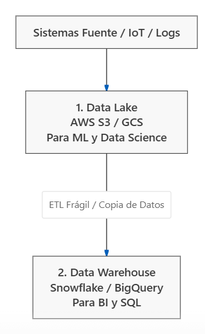{width="253"}

### **¿Por qué fallaba este esquema tradicional?**

1.  **Duplicación de datos:** Los datos se guardaban en el Data Lake y
    luego se copiaban mediante pipelines ETL complejos al Data
    Warehouse.

2.  **Desincronización e Inconsistencia:** Si la ingesta al Warehouse
    fallaba, los reportes de BI mostraban datos diferentes a los modelos
    de Machine Learning.

3.  **Altos Costos:** Pagar doble almacenamiento (en el Lake y en el
    DWH) y doble procesamiento.

4.  **Falta de Gobernanza Unificada:** Manejar permisos de acceso en S3
    por un lado y en el Data Warehouse por otro era una pesadilla de
    seguridad.

### Solución... Data Lakehouse

Un Data Lakehouse elimina la necesidad de tener dos sistemas. Permite
ejecutar consultas BI ultrarrápidas, SQL y modelos de Machine Learning
directamente sobre los archivos almacenados en el Data Lake.

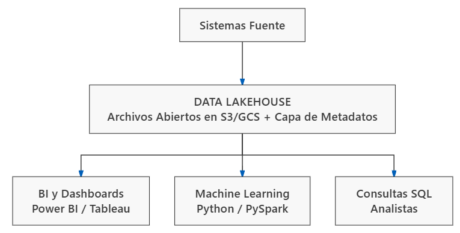{width="595"}

### **3. Pilares Tecnológicos del Data Lakehouse**

¿Cómo logra un Lakehouse el rendimiento de un Warehouse usando el
almacenamiento económico de un Lake? Gracias a tres elementos clave:

### **A. Formatos de Tabla Abiertos (Open Table Formats)**

Son la "magia" del Lakehouse. Agregan una capa de metadatos sobre los
archivos planos (usualmente Parquet) para tratar carpetas de archivos
como si fueran tablas SQL tradicionales:

-   **Delta Lake** (creado por Databricks)

-   **Apache Iceberg** (creado por Netflix)

-   **Apache Hudi** (creado por Uber)

### **B. Transacciones ACID**

Garantizan que si un pipeline está escribiendo millones de registros
mientras un usuario de BI hace una consulta, la consulta no falle ni lea
datos corruptos o a medias.

### **C. *Time Travel* (Viaje en el tiempo)**

Gracias al control de versiones en los metadatos, puedes consultar cómo
se veía una tabla en cualquier punto del pasado (ej.
`SELECT * FROM ventas FOR SYSTEM_TIME AS OF '2025-01-01'`). Esto es
ideal para auditorías y para reproducir experimentos de Machine
Learning.

### **D. Separación Total de Cómputo y Almacenamiento**

Pagas centavos por almacenar petabytes en AWS S3 / Cloud Storage, y solo
pagas cómputo cuando ejecutas consultas o procesos ETL.

## **¿Cómo se organizan los datos dentro de un Lakehouse? (Arquitectura Medallón)**

Para evitar que el Lakehouse se vuelva un "pantano de datos", los datos
se procesan en tres capas continuas:

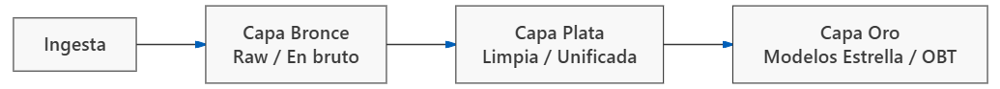

1.  **Capa Bronce (Raw Data):** Ingesta masiva sin alterar (JSONs, logs,
    descargas de base de datos).

2.  **Capa Plata (Silver / Cleaned):** Datos limpios, filtrados,
    deduplicados y consolidados (a menudo estructurados en **Data
    Vault** o relaciones 3NF).

3.  **Capa Oro (Gold / Business Level):** Estructurados específicamente
    para el consumo final usando Modelos Estrella (Star Schema) u OBT
    (One Big Table) para alimentarse directo en Power BI, Tableau o
    modelos predictivos.

### **Principales Plataformas del Mercado**

Hoy en día, casi todos los grandes proveedores han evolucionado hacia la
arquitectura Lakehouse:

-   **Databricks:** El creador del término y de *Delta Lake*.

-   **Snowflake:** Integración nativa con tablas *Apache Iceberg* en
    almacenamiento propio o del cliente.

-   **Google Cloud (BigQuery + BigLake):** Permite usar el motor de
    BigQuery directamente sobre archivos Iceberg/Parquet en Google Cloud
    Storage.

-   **AWS:** Integración de *Amazon Athena/Redshift* con *Apache
    Iceberg* y *AWS Glue*.

### **Resumen Final de la Evolución**

-   **Data Warehouse:** Estructurado, rígido, rápido para SQL, costoso.

-   **Data Lake:** Flexible, barato, soporta cualquier dato, pero lento
    y complejo para BI.

-   **Data Lakehouse:** Lo mejor de ambos mundos (flexible, económico,
    con rendimiento BI y transacciones ACID).

| **Característica** | **Data Warehouse 🏢** | **Data Lake 🌊** | **Data Lakehouse 🏠** |
|:---|:---|:---|:---|
| **Analogía** | Menú de restaurante fino. | Bodega/Mercado gigante. | Buffet con cocina abierta. |
| **Tipo de datos** | Solo estructurados (tablas). | Todo (estructurados, fotos, JSONs). | Todo (estructurados, fotos, JSONs). |
| **Costo** | Alto. | Muy bajo. | Bajo (almacenamiento) + Escalable (cómputo). |
| **Usuarios** | Analistas de BI / Power BI. | Científicos de Datos / ML. | **Todos** (BI, ML, SQL, Streaming). |
| **Velocidad BI** | Ultrarrápida. | Lenta / Compleja. | Ultrarrápida. |

#### Ejemplo aplicado en BigQuery


<https://cloud.google.com/bigquery>

Se nos abre el entorno de Big Query

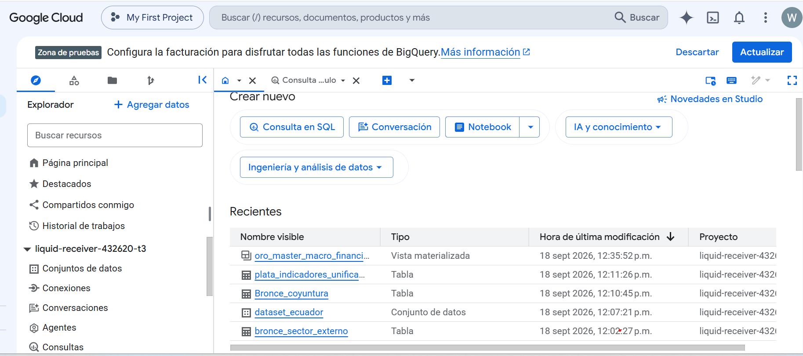

**¿Qué es BigQuery?**

Es un almacén de datos (Data Warehouse) en la nube de Google. A
diferencia de Excel, que se traba con un millón de filas, o de RStudio,
que depende de la memoria RAM de sus computadoras, BigQuery puede
analizar Petabytes de datos (miles de millones de filas) en segundos.
Esto pasa porque utiliza la infraestructura masiva de Google: tú no
compras servidores, solo subes tus datos y Google pone miles de
computadoras en la nube a trabajar para ti.

#### Consulta SQL

Copiamos y ejecutamos

``` sql
CREATE SCHEMA IF NOT EXISTS `dataset_ecuador`;
```

¿Por qué hicimos esto y qué significa? En el mundo de la nube, no
podemos dejar los datos flotando en el aire.

Un Dataset (o Conjunto de datos) es el equivalente a una carpeta del
sistema o una base de datos lógica. Es un contenedor. Le pusimos
`dataset_ecuador` porque ahí dentro guardaremos todas las tablas de
nuestro proyecto macroeconómico: las sucias, las limpias y los reportes
finales. El comando `IF NOT EXISTS` es una buena práctica de ingeniería;
le dice a BigQuery: 'Si la carpeta ya existe, no hagas nada; si no
existe, créala'.

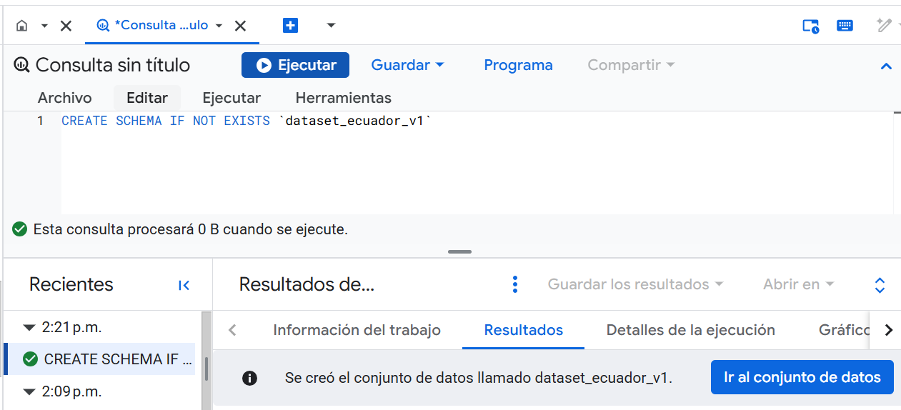

#### Creamos la ingesta de datos (Bronce)

> **¿Por qué se llama Bronce?** Porque aquí los datos están en su estado
> más puro y rústico. Entraron directo del proveedor. Tienen filas
> duplicadas, columnas con textos rotos como las fechas, y celdas vacías
> (`NULL`). En una empresa real, nunca debes permitir que los analistas
> de negocio o los gerentes consuman datos de la Capa Bronce, porque
> tomarían decisiones equivocadas basados en datos sucios."\*

Posterior cargamos los datos a la capa bronce...

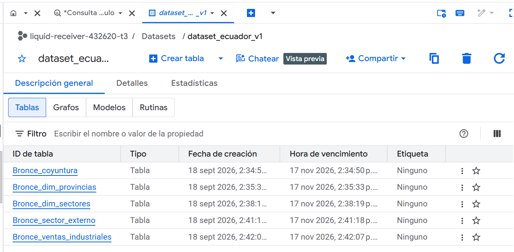

#### Creamos la capa plata (Transformación y limpieza SQL)

``` sql
CREATE OR REPLACE TABLE `dataset_ecuador_v1.Plata_coyuntura_limpia` AS
WITH datos_normalizados AS (
  SELECT
    -- Estandarizamos los formatos de fecha usando el nombre exacto Column1_period
    CASE 
      WHEN LENGTH(TRIM(Column1_period)) = 7 THEN PARSE_DATE('%Y-%m', TRIM(Column1_period))
      WHEN TRIM(Column1_period) LIKE '%/%' THEN PARSE_DATE('%d/%m/%Y', TRIM(Column1_period))
      WHEN LENGTH(TRIM(Column1_period)) = 10 THEN PARSE_DATE('%Y-%m-%d', TRIM(Column1_period))
      ELSE NULL
    END AS fecha_mes,
    
    -- Casteo de Strings a flotantes reemplazando 'NA' por NULL
    SAFE_CAST(NULLIF(TRIM(CAST(Column1_ideac_index AS STRING)), 'NA') AS FLOAT64) AS ideac_index,
    SAFE_CAST(NULLIF(TRIM(CAST(Column1_unemployment_rate AS STRING)), 'NA') AS FLOAT64) AS tasa_desempleo,
    SAFE_CAST(NULLIF(TRIM(CAST(Column1_underemployment_rate AS STRING)), 'NA') AS FLOAT64) AS tasa_subempleo
  FROM `dataset_ecuador_v1.Bronce_coyuntura`
)
SELECT 
  DATE_TRUNC(fecha_mes, MONTH) AS periodo_mensual,
  ROUND(AVG(ideac_index), 2) AS ideac_promedio,
  ROUND(AVG(tasa_desempleo), 2) AS desempleo_promedio_pct,
  ROUND(AVG(tasa_subempleo), 2) AS subempleo_promedio_pct
FROM datos_normalizados
WHERE fecha_mes IS NOT NULL
GROUP BY 1
ORDER BY periodo_mensual;
```

#### **1️⃣ Resolver Encabezados Sucios (`Column1_period`)**

> "Al importar el archivo crudo, los encabezados venían con puntos
> (`Column1.period`). BigQuery automáticamente reemplazó los caracteres
> inválidos con guiones bajos. En la Capa Plata renombraremos estas
> columnas con nombres amigables de negocio como `periodo_mensual`."

#### **2️⃣ Manejo de Nulos Encubiertos (`NULLIF(..., 'NA')`)**

> "Muchas fuentes externas (como APIs o Excel) envían el texto `'NA'`
> cuando falta un dato. Si intentas promediar o sumar el texto `'NA'`,
> la base de datos se cae o da error. Con `NULLIF(campo, 'NA')`
> convertimos ese texto engañoso en un **`NULL` real de base de datos**,
> permitiendo que funciones como `AVG()` calculen promedios correctos
> ignorando la falta de dato sin romper la consulta."

#### **3️⃣ Normalización de Múltiples Formatos de Fecha (`CASE` + `PARSE_DATE`)**

> "El archivo crudo tenía un desorden de fechas: unas filas venían como
> `2037-11` (Año-Mes), otras como `14/01/2016` (Día/Mes/Año) y otras
> como `2021-01-01`. Con nuestra condición `CASE`, identificamos la
> longitud y el formato del texto para transformar **todas las variantes
> en un objeto `DATE` estándar**."

#### **4️⃣ Agregación y Granularidad Mensual (`DATE_TRUNC` + `GROUP BY`)**

> "Como el archivo crudo tenía varios registros sueltos dentro del mismo
> mes, usamos `DATE_TRUNC(fecha_mes, MONTH)` para agrupar las filas por
> mes completo y calculamos el promedio mensual (`AVG`) del IDEAC,
> Desempleo y Subempleo."

``` sql
CREATE OR REPLACE TABLE `dataset_ecuador_v1.Plata_sector_externo_limpio` AS
WITH datos_normalizados AS (
  SELECT
    CASE 
      WHEN LENGTH(TRIM(fecha)) = 7 THEN PARSE_DATE('%Y-%m', TRIM(fecha))
      WHEN TRIM(fecha) LIKE '%/%' THEN PARSE_DATE('%d/%m/%Y', TRIM(fecha))
      WHEN LENGTH(TRIM(fecha)) = 10 THEN PARSE_DATE('%Y-%m-%d', TRIM(fecha))
      ELSE NULL
    END AS fecha_mes,
    
    SAFE_CAST(NULLIF(TRIM(CAST(exportaciones_petroleras_musd_fob AS STRING)), 'NA') AS FLOAT64) AS exp_petroleras,
    SAFE_CAST(NULLIF(TRIM(CAST(exportaciones_no_petroleras_musd_fob AS STRING)), 'NA') AS FLOAT64) AS exp_no_petroleras,
    SAFE_CAST(NULLIF(TRIM(CAST(importaciones_musd_fob AS STRING)), 'NA') AS FLOAT64) AS importaciones,
    SAFE_CAST(NULLIF(TRIM(CAST(remesas_musd AS STRING)), 'NA') AS FLOAT64) AS remesas
  FROM `dataset_ecuador_v1.Bronce_sector_externo`
)
SELECT 
  DATE_TRUNC(fecha_mes, MONTH) AS periodo_mensual,
  ROUND(AVG(exp_petroleras), 2) AS exp_petroleras_musd,
  ROUND(AVG(exp_no_petroleras), 2) AS exp_no_petroleras_musd,
  ROUND(AVG(importaciones), 2) AS importaciones_musd,
  ROUND(AVG(remesas), 2) AS remesas_musd
FROM datos_normalizados
WHERE fecha_mes IS NOT NULL
GROUP BY 1
ORDER BY periodo_mensual;
```

#### Creamos la capa plata (Transformación y limpieza SQL)

``` sql
CREATE OR REPLACE TABLE `dataset_ecuador_v1.Oro_master_macroeconomico` AS
SELECT 
  c.periodo_mensual,
  c.ideac_promedio AS indice_actividad_economica,
  c.desempleo_promedio_pct AS tasa_desempleo_pct,
  c.subempleo_promedio_pct AS tasa_subempleo_pct,
  e.exp_petroleras_musd,
  e.exp_no_petroleras_musd,
  -- KPI 1: Exportaciones Totales
  ROUND(e.exp_petroleras_musd + e.exp_no_petroleras_musd, 2) AS exportaciones_totales_musd,
  e.importaciones_musd,
  -- KPI 2: Balanza Comercial (Exportaciones Totales - Importaciones)
  ROUND((e.exp_petroleras_musd + e.exp_no_petroleras_musd) - e.importaciones_musd, 2) AS balanza_comercial_musd,
  e.remesas_musd,
  -- KPI 3: Flujo Neto de Divisas (Balanza Comercial + Remesas)
  ROUND(((e.exp_petroleras_musd + e.exp_no_petroleras_musd) - e.importaciones_musd) + e.remesas_musd, 2) AS flujo_neto_divisas_musd
FROM `dataset_ecuador_v1.Plata_coyuntura_limpia` c
JOIN `dataset_ecuador_v1.Plata_sector_externo_limpio` e 
  ON c.periodo_mensual = e.periodo_mensual
ORDER BY c.periodo_mensual;
```

1.  Hicimos un `JOIN` por `periodo_mensual`, uniendo por primera vez los
    datos del sector financiero/laboral con los datos del comercio
    exterior.

2.  Precalculamos los KPIs ejecutivos (Exportaciones Totales, Balanza
    Comercial y Flujo Neto de Divisas).

3.  Esta tabla está lista para conectarse directamente a cualquier
    herramienta de BI sin requerir ningún cálculo adicional."

**La idea principal es conectarlo a una herramienta de trabajo de
visualización en nuestro caso Power BI..**

#### **Resumen Ejecutivo de la Clase**

| **Etapa / Capa** | **Concepto Enseñado** | **Lo que hicieron en la práctica** |
|:---|:---|:---|
| **Data Lake** 🌊 | **Capa Bronce (Raw)** | Guardaron fuentes heterogéneas (CSVs) con fechas mixtas (`2016-01`, `08/01/2016`), textos `'NA'` y espacios, sin alterar la fuente original. |
| **Data Lakehouse** 🏠 | **Capa Plata (Clean)** | Usaron SQL en BigQuery para limpiar datos: `TRIM()` para espacios, `NULLIF('NA')` para nulos reales, `CASE + PARSE_DATE` para estandarizar fechas y `DATE_TRUNC + GROUP BY` para agrupar por mes. |
| **Data Warehouse** 🏢 | **Capa Oro (Master)** | Unieron las fuentes mediante un `JOIN` por mes y precalcularon los KPIs estratégicos (Balanza Comercial, Exportaciones Totales y Flujo Neto de Divisas). |
| **Self-Service BI** 📊 | **Power BI / Looker Studio** | Se conectaron directamente a la Capa Oro en 3 clics, creando gráficos instantáneos sin recargar la PC local ni limpiar nada en Power Query. |
